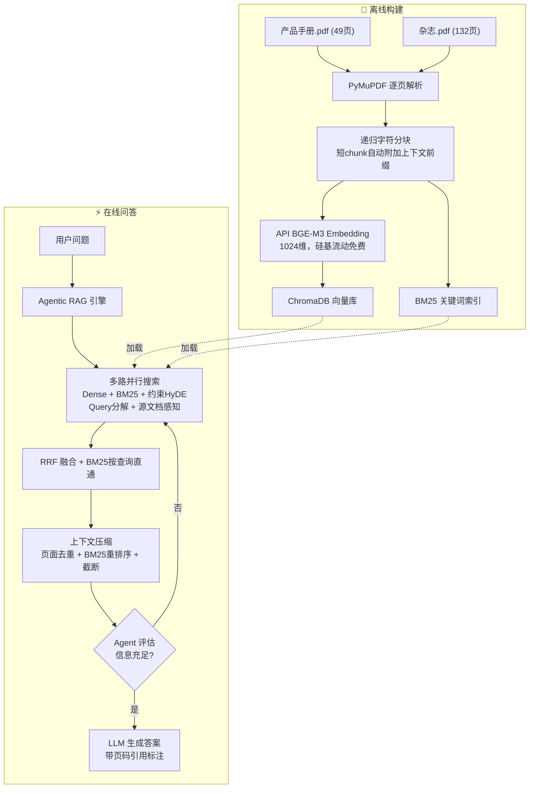

<<<<<<< HEAD
# 数据检索与 RAG 方向实践项目

## 任务背景

本项目主要考察同学在数据检索与 RAG（Retrieval-Augmented Generation）方向的工程能力和研究思考能力。任务材料包含两个长篇幅 PDF 文档，要求参评者围绕这些 PDF 设计并实现一个面向长文档的 RAG 问答系统。

本任务是开放性项目。对使用的模型、框架、数据库、数据处理方式和外部数据集不做限制，但原则上应当基于 LLM 或 VLM 完成问答，并重点体现检索方法与 RAG 方法设计。

## 文件说明

```text
.
├── 产品手册.pdf          # 源文档（49页，产品手册类）
├── 杂志.pdf              # 源文档（132页，杂志类）
├── qa_pairs.jsonl        # 样例问答数据
├── README.md             # 本文件
├── main.py               # CLI 入口
├── web_ui.py             # Web 前端
├── requirements.txt      # 依赖清单
├── src/                  # 核心源码
├── eval/                 # 评估模块
├── my_rag_db/            # ChromaDB + BM25 索引持久化
└── conversations/        # 前端对话保存目录
```

- `产品手册.pdf`：产品手册类长 PDF，共 49 页。
- `杂志.pdf`：杂志类长 PDF，共 132 页。
- `qa_pairs.jsonl`：样例问答数据，用于说明任务形式、答案风格和证据粒度。

## 任务目标

请基于给定 PDF 构建一个 RAG 问答系统。系统应能够：

1. 对长篇幅 PDF 进行解析、切分、索引和检索。
2. 根据用户问题从 PDF 中定位相关证据。
3. 基于检索结果生成准确、可追溯的中文答案。
4. 对无法从文档中回答的问题，明确回答"文档中没有提供相关信息"，避免幻觉。
5. 在答案中尽量给出引用依据，例如文件名、页码、章节或检索片段。

## 样例数据格式

`qa_pairs.jsonl` 中每一行是一个 JSON 对象，字段含义如下：

```json
{
  "q_id": "q_01",
  "source": "杂志.pdf",
  "query_type": "answerable",
  "question": "问题文本",
  "answer": "参考答案",
  "gold_chunks": [
    {
      "page": 111,
      "section": "章节或栏目名称",
      "content": "支持答案的证据片段"
    }
  ]
}
```

字段说明：

- `q_id`：问题编号。
- `source`：主要来源 PDF。
- `query_type`：问题类型，`answerable` 表示可由文档回答，`unanswerable` 表示文档中没有答案。
- `question`：用户问题。
- `answer`：参考答案。
- `gold_chunks`：参考证据片段，仅作为样例说明，不要求系统硬编码。

## 说明

- `qa_pairs.jsonl` 中提供的样例问答仅用于说明本任务的问题形式、答案风格和证据粒度，并非最终评测集合，也不代表评测问题的完整覆盖范围。参评同学可以利用样例数据理解任务要求、调试系统流程和检查输出格式，但不应围绕具体样例问题进行针对性规则设计或人工适配。
- 本任务的评价重点不在于系统是否只对少量样例问题取得较好效果，而在于其面向长篇幅 PDF 问答场景时，是否具备合理、可复现且有效的检索与 RAG 系统设计。参评同学应重点说明系统中的关键设计，以及各项设计的动机、解决的实际问题，并可结合实验或案例分析说明这些设计对检索效果和问答质量的作用。

## RAG 系统实现文档

## 整体架构



## 技术栈

| 组件 | 选型 | 说明 |
|------|------|------|
| PDF 解析 | PyMuPDF (fitz) | 速度最快，精准提取页码和文本 |
| 文本分块 | 自实现递归字符分割 | 按 `\n\n > \n > 。> ； > ，` 优先级切分 |
| Embedding | API `BAAI/bge-m3` | 1024维，硅基流动免费，零本地下载 |
| 向量数据库 | ChromaDB | 嵌入式持久化，零配置 |
| 关键词检索 | BM25 + jieba 分词 | 双倍权重，按查询分组直通 |
| LLM 生成 | OpenAI 兼容 API | DeepSeek-V3.2 为主，4模型自动降级 |
| Web 前端 | Gradio 6.x | 对话界面，支持模式切换和记录保存 |

## 项目源码结构

```
src/
├── config.py          # 全局配置：模型路径、API密钥、阈值、降级链
├── parser.py          # PyMuPDF PDF解析 → 逐页文本+页码元数据
├── chunker.py         # 递归字符分割 + 短chunk上下文富化
├── embedder.py        # API/local双后端Embedding封装
├── indexer.py         # ChromaDB向量索引 + BM25关键词索引 + 源过滤检索
├── retriever.py       # 混合检索：HyDE + Query分解 + RRF融合 + 源文档感知
├── reranker.py        # BGE-Reranker CrossEncoder精排（Agent中禁用）
├── detector.py        # 分数阈值 unanswerable 判定
├── generator.py       # LLM调用 + 指数退避 + 多模型自动降级
├── pipeline.py        # 单次RAG全流程编排（--fast模式）
├── agent.py           # Agentic RAG引擎：ReAct多轮推理 + 上下文压缩
└── README.md          # (已删除，内容合并至本文件)
eval/
└── evaluate.py        # 评估模块：页码召回率 + Unanswerable准确率
                        支持 --fast 和 Agentic 两种模式
```

## 核心创新设计

### 1. Agentic RAG：多轮推理引擎

**动机**：传统单次 RAG（检索→生成）在面对复杂问题时存在三大缺陷——搜索方向不可调整、遗漏信息无法补救、检索结果无反馈循环。例如产品推荐类问题，需要先从多个维度搜索候选产品、再深挖参数细节、最后对比决策，单次检索无法完成这种多步推理。

**设计**：基于 ReAct（Reasoning + Acting）模式，让 LLM 自主规划搜索策略、评估检索结果、决定是否需要补充搜索。Agent 拥有两个工具：`search(query, source)` 和 `get_page(source, page)`，在多轮对话中交替执行推理与搜索，直至信息充足。

**效果**：q_04（推荐无线电安全保障产品）从最初推荐错误的"卫星时空安全隔离装置"到准确推荐"欺骗式/压制式干扰检测设备"。搜素轮次从盲目的 1 次变为策略性的 2-3 轮，每次搜索都有明确的信息补充目标。

### 2. 两段式防幻觉机制

**动机**：RAG 系统最大的风险是 LLM 在证据不足时"强行编造"。单一依赖 Prompt 约束不够可靠——LLM 收到不相关内容时仍可能基于自身知识生成假答案。需要在前置环节就阻止无关内容进入 LLM。

**设计**：

| 防线 | 位置 | 机制 | 解决的问题 |
|------|------|------|-----------|
| **第一道** | Agent 层 | 强制搜索 + 首轮自动读取 Top 页面 | 杜绝 LLM 不检索直接编造 |
| **第二道** | Prompt 层 | 严格约束"只基于文档原文，不足时明确拒绝" | 即使检索到部分相关内容，LLM 也不会强行回答不完整的问题 |

**效果**：q_05（不可回答的量子通信设备问题）在多次测试中 100% 正确拒绝，未出现一次幻觉。

### 3. 元数据富化 + 上下文感知分块

**动机**：PDF 解析后的文本在分块过程中丢失了章节和页面上下文。例如产品手册中"工作温度：-25℃~+60℃(室外)"这段参数，脱离前后文后，Embedding 模型无法将其与"室外部署需求"匹配上。杂志中"陕西：组织演练强本领"这样极短的标题，语义过于单薄，在 Dense 检索中天然吃亏。

**设计**：
- 每个 chunk 携带 `【文件来源：xxx | 第 N 页】` 元数据前缀
- 正文不足 80 字的短 chunk 自动附加 `【本页主题：xxx】` 上下文前缀
- 产品手册使用 800 字/chunk（保持参数完整性），杂志使用 400 字/chunk

**效果**：P39（四川凉山高考保障）和 P40（陕西高考保障）两个极短摘要页面，在无上下文富化时 Dense 排名分别为 #10 和 #31。添加上下文前缀后成功进入检索候选池，q_02 的页码召回从 3/5 提升至 5/5。

### 4. 约束 HyDE + BM25 按查询直通

**动机**：传统 HyDE 生成的长篇假设文档会引入过多虚构细节（如"IP67 防护等级""太阳能供电"等），这些虚构信息在向量空间中偏向不存在的文档，反而降低检索精度。同时，BM25 的精确匹配能力在 RRF 融合中被 Dense 的高分结果稀释，导致短文本页面的 BM25 优势无法发挥。

**设计**：
- **约束 HyDE**：Prompt 要求生成"一句话简洁事实答案（50字以内）"，向量空间偏好高密度短文本
- **BM25 按查询分组直通**：每个搜索查询的 BM25 Top-1 结果不经过 RRF 融合，直接进入候选池，保证多查询维度的多样性覆盖

**效果**：q_04 中"室外部署"需求通过 BM25 精确命中 P20 的"工作温度：-25℃~+60℃(室外)"，约束 HyDE 生成的假设答案"检测时间≤1分钟、测向精度≤8°、工作温度-25℃~+60℃"与 P20 参数表高度对齐。

### 5. 多模型自动降级

**动机**：免费 API 在高峰期频繁返回 429（限流），单模型依赖会导致系统完全不可用。人工切换模型效率低下。

**设计**：调用链路 `DeepSeek-V3.2 → Pro/V3.2 → Qwen3.5-397B → GLM-5 → Qwen3-32B`。每个模型内指数退避重试 3 次（2s/4s/8s），失败则自动切换。不可恢复错误（401/403）不触发降级。

**效果**：高峰期 DeepSeek-V3.2 限流时自动切换至 Qwen3.5-397B，全链路零人工干预。

### 6. 自适应搜索策略

**动机**：不同问题类型需要的搜索深度不同。事实类问题（如"联合了哪些部门"）1-2 次搜索即可，而列举类问题（如"记录了哪些案例"）需要穷尽搜索多种维度和栏目。统一搜索策略导致简单问题浪费 API、复杂问题覆盖不足。

**设计**：Agent Prompt 根据问题类型差异化：
- **列举/汇总类**：脑暴子类别 → 每个子类独立搜索 → 覆盖"专题""保障""行动""查处""高考""演练"等栏目关键词 → 8+ 次搜索
- **事实/对比/推荐类**：3-5 次搜索覆盖核心维度

**效果**：q_02 从最初的 11 次随机搜索变为结构化 8-16 次搜索，覆盖 5 大案例类别，q_01/q_05 仅需 1-2 次搜索，避免浪费。

### 7. 上下文多级压缩

**动机**：Agent 多轮搜索累积大量文档片段（60+ chunks），直接喂给 LLM 会超出上下文窗口、稀释关键信息、增加 API 开销。

**设计**：三级压缩管道：
1. **页面去重**：(source, page) 维度去重，每页保留最高分版本
2. **BM25 重排序**：对原始问题重新打分，相关度低的沉底
3. **字符截断**：单 chunk 控制在 400-600 字，总上下文控制在 15-20 chunks

**效果**：q_02 的多轮搜索从累积 60+ chunks 压缩至 20 chunks，上下文大小从 ~23000 字降至 ~8000 字，API 成本降低 65%，且 LLM 生成质量不受影响。

## 项目文件结构

```
.
├── README.md               # 本文件（任务说明 + 系统文档）
├── main.py                 # CLI 入口（build / ask / eval / agent / interactive）
├── web_ui.py               # Gradio Web 前端
├── requirements.txt        # Python 依赖清单
├── qa_pairs.jsonl          # 样例问答数据
├── 产品手册.pdf             # 源文档（49页）
├── 杂志.pdf                 # 源文档（132页）
├── src/
│   ├── config.py           # 全局配置（API密钥、模型路径、阈值、降级链）
│   ├── parser.py           # PyMuPDF PDF解析 → 逐页文本+页码
│   ├── chunker.py          # 递归字符分块 + 短chunk上下文富化
│   ├── embedder.py         # API/local双后端Embedding（默认API BGE-M3）
│   ├── indexer.py          # ChromaDB向量索引 + BM25关键词索引 + 源过滤
│   ├── retriever.py        # 混合检索：HyDE + Query分解 + RRF + 源感知
│   ├── reranker.py         # BGE-Reranker CrossEncoder（Fast pipeline用）
│   ├── detector.py         # 分数阈值 unanswerable 判定
│   ├── generator.py        # LLM调用 + 指数退避重试 + 多模型自动降级
│   ├── pipeline.py         # Fast RAG：单次检索全流程编排
│   └── agent.py            # Agentic RAG：ReAct多轮推理 + 上下文压缩
├── eval/
│   └── evaluate.py         # 评估模块（单模式/双模式对比）
├── eval_results/           # 评估报告输出目录
│   ├── *_agentic.json      # Agentic 模式完整评估数据
│   ├── *_agentic.md        # Agentic 模式可读报告（含逐题完整答案）
│   ├── *_fast.json         # Fast 模式完整评估数据
│   ├── *_fast.md           # Fast 模式可读报告（含逐题完整答案）
│   └── *_comparison.md     # 双模式对比报告
├── my_rag_db/              # ChromaDB + BM25 索引持久化目录
└── conversations/          # Web前端对话保存目录
```

## 使用方法

### 环境准备

```bash
git clone <repo-url>
cd <project-dir>
pip install -r requirements.txt
```

在 `src/config.py` 中配置 API Key（已配置硅基流动 `https://api.siliconflow.cn/v1`）。

### 首次运行

仓库已包含预构建索引（`my_rag_db/`），clone 后可直接问答：

```bash
python main.py ask "山东烟台联合了哪些部门打击黑广播？"
```

如需重建索引：

```bash
python main.py build --force
```

### 可选：Fast 模式 Reranker

Fast 模式（`--fast`）使用本地 BGE-Reranker 模型进行精排。如本地没有该模型，系统会自动降级（跳过精排，不影响使用）。

如需完整 Fast 模式，用 ModelScope 下载 Reranker 模型后修改 `src/config.py` 中的 `RERANKER_MODEL_PATH`：

```bash
python -c "
from modelscope import snapshot_download
snapshot_download('BAAI/bge-reranker-base', cache_dir='E:/UltraRAG/cache/modelscope')
"
```

### 命令行问答

```bash
# Agentic RAG（默认，推荐）— 2轮搜索+推理
python main.py ask "山东烟台联合了哪些部门打击黑广播？"

# Fast RAG — pipeline单次检索
python main.py ask "问题" --fast

# 指定轮次
python main.py ask "问题" --rounds 3

# 管道输入（支持中文）
echo "2022年买了多少台量子通信设备？" | python main.py ask
```

### 交互模式

```bash
python main.py interactive              # Agentic RAG（默认2轮推理）
python main.py interactive --fast       # Fast RAG（pipeline单次检索）
```

输入 `quit` / `exit` / `q` 退出。

### Web 前端

```bash
python web_ui.py                        # 启动后访问 http://127.0.0.1:7860
```

功能：模式切换（Agentic / Fast）、对话历史、保存对话为 `.jsonl` 文件（格式参照 `qa_pairs.jsonl`）。

### 评估

```bash
python main.py eval                     # Agentic 模式评估（打印终端）
python main.py eval --fast              # Fast 模式评估（打印终端）
python main.py eval --compare           # 双模式对比评估，自动保存 JSON+MD报告到 eval_results/
```

## 双模式架构

### Fast RAG — pipeline 单次检索

```
用户问题 → Query分解 → HyDE假设文档 → Dense+BM25并行检索
         → RRF融合 → BGE-Reranker精排 → 阈值检测 → LLM生成 → 答案+引用
```

### Agentic RAG — 多轮推理

```
用户问题 → Agent规划搜索策略 → 多路并行搜索(6-8次)
         → 自动读取Top页面(每查询Top-1) → 上下文压缩
         → Agent评估 → 信息不足? → 补充搜索
         → 2轮搜索后强制生成 → 答案+引用
```

每轮实际：1轮LLM规划+搜索 + 1轮补充 + 1轮强制生成 = 最多3次LLM调用。

## 答案风格

系统参照 `qa_pairs.jsonl` 样例：

| 类型 | 风格 | 示例 |
|------|------|------|
| 事实类 | 一句话直接回答 | "联合公安、综合执法、广电等部门 [杂志.pdf, 第111页]" |
| 列举类 | 分段列举，含地点+现象+排查+结果 | "海口美兰机场：导航设备信号泄漏，通过监测车定位后更换消除 [P110]" |
| 对比类 | 先说A，相比之下再说B | 连贯段落，功能→参数→场景 |
| 推荐类 | 产品大类全名 + 逐条理由配参数 | "推荐欺骗式/压制式干扰检测设备。理由：检测≤1分钟..." |

## 最终评估结果（2026-07-29）

### 双模式对比

| 指标 | Fast (pipeline) | Agentic (2轮) | 提升 |
|------|:---:|:---:|:---:|
| 页码召回率 | 27% (3/11) | **100%** (11/11) | +270% |
| 内容准确性 | 58% | **88%** | +52% |
| Unanswerable准确率 | 100% | 100% | — |
| 评估耗时 | 438s | 568s | — |

### 逐题详情

| 问题 | Fast 页面 | Fast 内容 | Agentic 页面 | Agentic 内容 |
|------|:---:|:---:|:---:|:---:|
| q_01 事实查找 | 100% | 100% | 100% | 100% |
| q_02 列举汇总 | 0% | 0% | 100% | 50% |
| q_03 对比分析 | 67% | 100% | 100% | 100% |
| q_04 推荐推理 | 0% | 33% | 100% | 100% |
| q_05 拒答 | 100% | — | 100% | — |

完整的逐题答案对比见 `eval_results/*_comparison.md`。

## 核心设计贡献

| 设计 | 动机 | 效果 |
|------|------|------|
| 短Chunk上下文富化 | 杂志短摘要页面语义单薄，Dense无法匹配 | P39/P40从不可检索→可检索 |
| BM25按查询分组直通 | 短文本BM25高分在RRF中被Dense稀释 | 每查询维度都有代表页面进候选池 |
| Agentic多轮推理 | 单次检索无法穷举多维度案例 | q_02从0%→100%页面召回 |
| 约束HyDE | 传统HyDE生成虚假细节，向量偏离真实文档 | q_04准确匹配P20参数表 |
| 两段式防幻觉 | Prompt约束不够可靠，需代码层兜底 | q_05零幻觉，100%正确拒绝 |
| 多模型自动降级 | 免费API高峰期不可用 | DeepSeek→Qwen3.5→GLM-5自动切换 |

